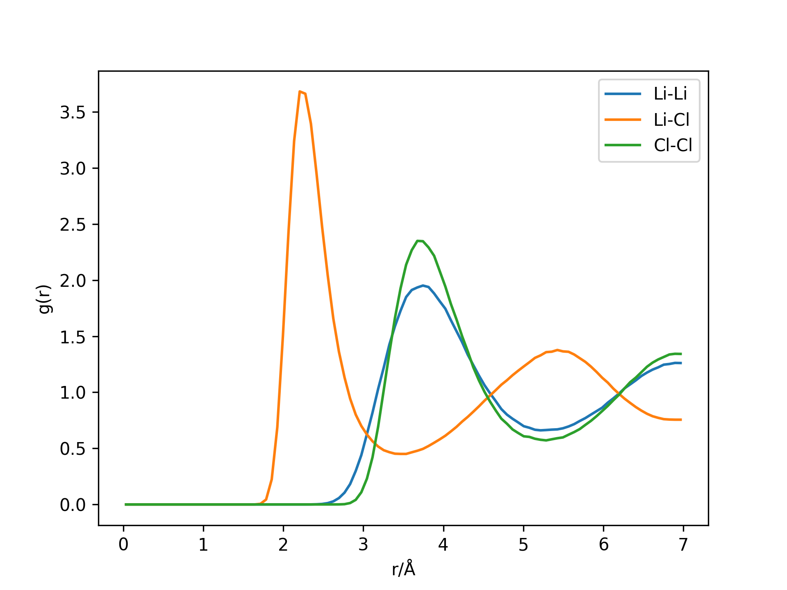
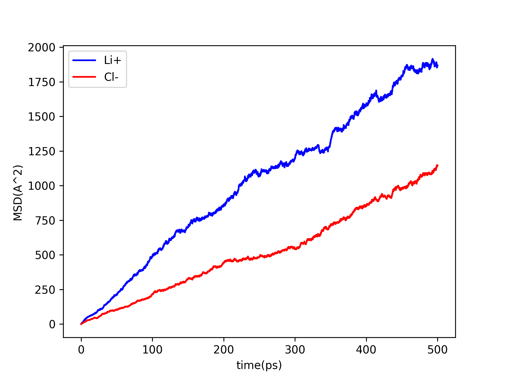

# LAMMPS 经典分子动力学模拟

对于LiCl熔体，可以使用LAMMPS（Large-scale Atomic/Molecular Massively Parallel Simulator）软件进行经典分子动力学模拟。LAMMPS是一个高度灵活且可扩展的分子动力学模拟软件，支持多种原子间势和模拟条件。在这个示例中，我们使用经典BMH势函数模拟LiCl熔体的结构和动力学性质。

## 目标

学习完本课程后你应该：

- 了解 LAMMPS 的输入和输出文件；
- 能够为 LiCl 熔体撰写 LAMMPS MD模拟输入文件；
- 计算 LiCl 熔体的微观结构和扩散性质。

## 资源

在本教程中，我们以LiCl熔体分子为例,进行经典分子动力学模拟。我们已经在`work/ex1`中准备了需要的文件。
```
wget --content-disposition https://github.com/LiangWenshuo1118/LiCl/raw/main/work.tar.gz
tar zxvf work.tar.gz

```

在work/ex1文件夹包含以下文件：
- in.licl: 用于指定LAMMPS MD模拟的细节；
- licl.data: 用于存放md模拟的初始构型；
- ave_rdf.py: 用于进一步处理lammps输出文件，绘制rdf图象的python脚本。
- msd.py：用于进一步处理lammps输出文件，绘制msd图象和计算扩散性质的python脚本

本教程采用 DeePMD-kit(2.1.5)软件包中预置的 LAMMSP 程序完成。

## 作业

### LAMMPS MD模拟输入文件

下面是一个 LiCl 熔体 LAMMPS MD模拟控制文件的示例：

```
# this input script is for simulating a 3d LiCl melt at 900K using LAMMPS.

# initialize simulation settings
units           metal
boundary        __*FILL*__
atom_style      FILL

# define the simulation cell
read_data       FILL

group           _FILL_  type 1
group           FILL  type 2
set             type 1 charge FILL
set             type 2 charge FILL

# set force field
pair_style      born/coul/long 7
pair_coeff      1 1 0.4225000 0.3425 1.632 0.045625 0.01875
pair_coeff      FILL FILL FILL FILL FILL FILL FILL
pair_coeff      FILL FILL FILL FILL FILL FILL FILL
kspace_style    ewald 1.0e-6 	

# nvt simulation  
velocity        all create FILL 23456789
fix             1 all nvt temp FILL FILL FILL
timestep        FILL

# rdf calculation 
compute         rdf all rdf 100 FILL FILL FILL FILL FILL FILL
fix             2 all ave/time 100 1 100 c_rdf[*] file licl.rdf mode vector

# msd calculation
compute         msd1 Li msd
compute         msd2 Cl msd
fix             3 all ave/time 100 1 100 c_msd1[4] c_msd2[4] file licl.msd

# output
thermo_style    custom step temp pe ke etotal press lx ly lz vol
thermo          1000

dump            1 all custom 1000 licl.dump id type x y z

run             500000

```

- `units metal`：用于设置模拟中使用的单位系统。对于metal，时间的单位是皮秒（ps），长度的单位是埃（Å），质量的单位是原子质量单位（amu），能量的单位是电子伏特（eV），温度的单位是开尔文（K），压力的单位是巴（bar），速度的单位是埃/皮秒（Å/ps）。

- `boundary`：用于设置模拟的边界条件。p 表示周期性，f 表示固定边界条件。填写提示：在这种情况下，我们使用周期性（periodic）边界条件，周期性边界条件可以表示为"p p p"。

- `atom_style`：用于设置原子类型和属性。填写提示：在这个示例中，我们使用带电原子模型，因此使用 charge 类型。

- `read_data`：用于读取数据文件。填写提示：在这个示例中，数据文件名为licl.data。

- `group`：用于根据原子类型创建组。填写提示：在这个示例中，我们创建了两个分组，包含元素类型 1（Li）和元素类型 2（Cl）。

- `set type charge`：用于设置原子类型 1 和 2 的电荷。填写提示：在这个示例中，元素类型 1（Li）被设置为带有 +1 电荷，元素类型 2（Cl）被设置为带有 -1 电荷。

- `pair_style born/coul/long 7`：用于设置原子之间的相互作用势函数。在这个示例中，我们使用 Born−Mayer−Huggins 势函数：

$$ U_{i j}(r)=\frac{q_i q_j}{r}+A_{i j} b \exp \left(\frac{\sigma_{i j}-r}{\rho}\right)-\frac{C_{i j}}{r^6}-\frac{D_{i j}}{r^8} $$

其中第一项描述了离子之间的静电相互作用，$q_i$是离子电荷（$q_{Li}$= +1，$q_{Cl}$=-1）；第二项描述由于电子云的重叠引起的短程斥力，$A_{i j}$是 Pauling 因子（$A_{Li Li}$=2.00，$A_{Li Cl}$=1.375，$A_{Cl Cl}$=0.75），b 是一个常数（$b=0.338 \times 10^{-19} \mathrm{~J}$），$σ_{i j}$是晶体离子半径，而ρ是硬度参数($ρ_{LiCl}$ = 0.3425 Å)；最后两项对应于偶极-偶极和偶极-四极子色散相互作用，其中$C_{i j}$和$D_{i j}$是色散参数。7是截断距离（cutoff distance），单位为Å，超过这个距离的原子间作用将被忽略。

|    |$A_{i j}b$(eV)|$σ_{i j}$(Å)|$C_{i j}$(eV)|$D_{i j}$(eV)|
|----|--------------|------------|-------------|-------------| 
| ++ | 0.4225000    | 1.632      |0.045625     |0.01875      |
| +- | 0.2904688    | 2.401      |1.250000     |1.50000      |
| -- | 0.1584375    | 3.170      |69.37500     |139.375      |

- `pair_coeff`：用于为相互作用势函数设置参数。每个 pair_coeff 命令将相互作用势函数中的原子类型之间的参数设置为指定值。填写提示：在这个示例中，我们已经设置了 锂-锂离子之间的相互作用参数。请设置锂-氯和氯-氯离子之间的相互作用参数。

- `kspace_style`：用于设置Ewald方法计算长程库仑相互作用。在这个示例中，我们使用了Ewald方法，使用了 1.0e-6 的精度。

- `velocity`：用于为模拟系统中的所有原子设置随机速度。填写提示：设置模拟的温度。

- `fix nvt`：用于对模拟系统进行NVT(等温-等体积）模拟。填写提示：在这个示例中，我们将模拟系统的初始和最终温度设置为900K，温度阻尼系数0.5。

- `timestep`：用于设置模拟的时间步长。填写提示：在这个示例中，时间步长为0.001皮秒。

- `compute rdf`：用于计算模拟系统中两种原子之间的径向分布函数（RDF），100表示分100个统计区间。填写提示：在这个示例中，我们将计算Li-Li，Li-Cl和Cl-ClRDF，它们分别用1 1，1 2和2 2表示。

- `fix 2 all ave/time 100 1 100 c_rdf[*] file licl.rdf mode vector`：用于对计算的RDF数据进行时间平均，并将结果输出到文件中。使用fix 2对RDF数据进行时间平均，100 1 100分别为Nevery(每100步计算1次rdf)，Nrepeat(平均最近1次的计算的rdf，用于输出)和Nfrequency(每100步输出一次rdf)， 在这个案例中会每100步会输出一次rdf。使用c_rdf[*]表示平均所有RDF分量，使用file licl.rdf表示将结果输出到名为licl.rdf的文件中，使用mode vector表示输出向量格式的数据。

- `compute msd1 Li msd` 和 `compute msd2 Cl msd`：这些命令用于计算两种原子在模拟过程中的平均平方位移（MSD）。在这个示例中，我们使用compute msd1计算Li原子的 MSD，使用compute msd2计算Cl原子的MSD。

- `fix 3 all ave/time 100 1 100 c_msd1[4] c_msd2[4] file licl.msd`：用于对计算的MSD数据进行时间平均，并将结果输出到文件中。使用fix 3对MSD数据进行时间平均，使用c_msd1[4]和c_msd2[4]表示平均两种原子的MSD, 使用file licl.msd表示将结果输出到名为licl.msd的文件中。

- `thermo_style custom step temp pe ke etotal press lx ly lz vol`：用于设置LAMMPS在模拟过程中输出的热力学信息。在这个示例中，我们使用thermo_style custom 表示使用自定义的输出格式，使用step temp pe ke etotal press lx ly lz vol表示要输出的信息，包括模拟步数、温度、势能、动能、总能量、压强以及模拟盒子的尺寸和体积。

- `thermo`：该命令用于设置输出热力学信息的频率。填写提示：在这个示例中，我们将每1000步输出一次热力学信息。

- `dump 1 all custom 1000 licl.dump id type x y z`：用于在模拟过程中输出原子的坐标信息。在这个示例中，使用dump 1 all表示输出模拟系统中的所有原子，使用 custom表示使用自定义的输出格式，使用1000表示输出频率，使用licl.dump表示输出文件的名称，使用id type x y z表示输出的原子信息，包括原子的ID、类型以及在x、y、z 方向上的坐标。

- `run` 用于运行LAMMPS模拟，进行一定步数的时间演化。在这个示例中，该命令将模拟系统进行500000步时间演化。在每个时间步长中，LAMMPS会根据当前的原子位置、速度和势能计算新的位置、速度和势能。通过这个过程，我们可以观察模拟系统的时间演化行为，比如温度、压力和分子运动轨迹等。需要注意的是，run命令需要根据实际情况进行设置，以保证模拟过程的充分和准确。

下面是一个LiCl熔体LAMMPS MD模拟初始构型的示例：
```
# LAMMPS data file 
108 atoms
2 atom types
0.0 13.4422702789 xlo xhi
0.0 13.4422702789 ylo yhi
0.0 13.4422702789 zlo zhi

Masses

1 6.941  # Li
2 35.453  # Cl

Atoms  # charge

1 1 0.0 9.10297966 1.4528499842 12.3941898346  
2 1 0.0 11.53647995 2.3037500381 1.6365799904
3 1 0.0 1.3658800125 9.3088798523 4.9590802193
...
106 2 0.0 5.8468399048 2.629529953 3.9059700966
107 2 0.0 7.0047798157 5.3034000397 10.0816297531
108 2 0.0 4.4860801697 11.4718704224 13.3586997986
```
该文件描述模拟系统（LiCl）的基本信息和初始状态。

首先是模拟系统的基本信息：模拟系统中有 108 个原子，两种类型的原子（Li和Cl），模拟系统在x、y、z三个方向上的盒子大小分别是 0.0 到 13.4422702789，两种类型的原子的质量分别是 6.941和35.453。

后面一部分是原子的位置和电荷信息：每行依次表示原子的ID、类型、电荷以及在 x、y、z 三个方向上的坐标。注意，此处电荷都是0.0，我们可以在in.licl中重新规定电荷。

### 运行LAMMPS MD模拟 

在了解in.licl和licl.data文件后，我们可以执行以下命令以启动LiCl熔体的MD模拟：

```
lmp -i in.licl
```

我们可以看到在当前文件夹下生成了以下几个文件：
- log.lammps：日志文件，记录了模拟过程中的各种输出信息，包括初始系统状态、MD过程中的能量、温度、压力等物理量，以及各种计算的结果。
- licl.dump：轨迹文件，记录了模拟系统在每个时间步长中所有原子的位置、速度等信息。
- licl.rdf：径向分布函数（RDF）文件，记录了每Nfrequency步数输出的RDF。
- licl.msd：均方位移（MSD）文件，记录了模拟系统中离子的均方位移随时间的变化。

对于licl.dump文件，我们可以使用OVITO等软件进行可视化。

对于 licl.rdf文件，我们可以利用如下python脚本进行进一步处理和绘图：

```python
import numpy as np
import matplotlib.pyplot as plt

nbins = 100                          # 计算RDF使用的统计区间个数

with open("licl.rdf", "r") as f:     # 逐行读取"licl.rdf"的文件，忽略文件中的注释行(前三行)
    lines = f.readlines()           
    lines = lines[3:]                

    data = np.zeros((nbins, 7))      # 创建一个二维数组data，用于存储RDF数据
    count = 0                       

    for line in lines:               # 对相同统计区间的数据进行累加，并计算累加次数
        nums = line.split()         
        if len(nums) == 8:          
            for i in range(1, 8):   
                data[int(nums[0])-1, i-1] += float(nums[i])  
        if len(nums) == 2:
            count += 1

ave_rdf = data / count               # 计算每个统计区间的平均计数，保存到文件"ave_rdf.txt"中
np.savetxt('ave_rdf.txt',ave_rdf)   

labels = ['Li-Li', 'Li-Cl', 'Cl-Cl'] # 绘制并保存RDF图像
for i, label in zip(range(1, 7, 2), labels):             
    plt.plot(ave_rdf[:, 0], ave_rdf[:, i], label=label)  
plt.xlabel('r/Å')                                        
plt.ylabel('g(r)')                                       
plt.legend()                                             
plt.savefig('rdf.png', dpi=300) 
```
正常情况下，我们将获得类似于下面的图象：



对于 licl.msd文件，我们可以利用如下python脚本进行进一步处理和绘图：
```python
import numpy as np
import matplotlib.pyplot as plt

data = np.loadtxt('licl.msd', skiprows=2)        # 加载数据，跳过文件中的注释行(前三行)

time = data[:, 0]                                # 数据按列分割
msd1 = data[:, 1]
msd2 = data[:, 2]

plt.plot(time/1000, msd1, 'b-', label='Li+')     # 绘制MSD曲线；1fs= 1/1000ps
plt.plot(time/1000, msd2, 'r-', label='Cl-')
plt.xlabel('time(ps)') 
plt.ylabel('MSD(A^2)')

slope1, residuals = np.polyfit(time, msd1, 1)    # 求MSD曲线斜率
slope2, residuals = np.polyfit(time, msd2, 1)

Diff1 = slope1/6 * 1e-5                          # D=1/6*slope; 1 A^2/fs = 1e-5 m^2/s
Diff2 = slope2/6 * 1e-5

print(f"Diffusion Coefficients of Li+: {Diff1} m^2/s")
print(f"Diffusion Coefficients of Cl-: {Diff2} m^2/s")

plt.legend()
plt.savefig('msd.png',dpi=300)
```

正常情况下，我们将获得类似于下面的图象：



以及从均方位移导出的扩散系数的数值：
```
Diffusion Coefficients of Li+: 6.226084916654326e-09 m^2/s
Diffusion Coefficients of Cl-: 3.5874140996046757e-09 m^2/s
```

注意：扩散系数的值可能和文献[1]报道存在差异。我们可以考虑以下几个方面，以获得更准确的值：

- 首先在NPT系综进行模拟，将压力固定在0GPa，获得平衡体积。然后在平衡体积下进行NVT模拟。
- 使用更大的模拟盒子。
- 设置更长的模拟时间。

[1] J. Phys. Chem. B 2014, 118, 10196−10206(10.1021/jp5050332) 
